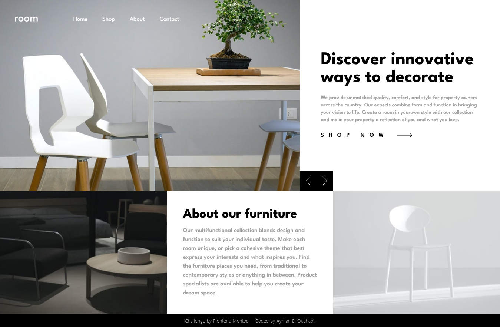

# Frontend Mentor - Room homepage solution

This is a solution to the [Room homepage challenge on Frontend Mentor](https://www.frontendmentor.io/challenges/room-homepage-BtdBY_ENq). Frontend Mentor challenges help you improve your coding skills by building realistic projects. 

## Table of contents

- [Overview](#overview)
  - [The challenge](#the-challenge)
  - [Screenshot](#screenshot)
  - [Links](#links)
- [My process](#my-process)
  - [Built with](#built-with)
- [Author](#author)

## Overview

### The challenge

Users should be able to:

- View the optimal layout for the site depending on their device's screen size
- See hover states for all interactive elements on the page
- Navigate the slider using either their mouse/trackpad or keyboard

### Screenshot

### Links

- Solution URL: [https://github.com/aymanobi/Room-homepage](https://github.com/aymanobi/Room-homepage)
- Live Site URL: [Add live site URL here](https://your-live-site-url.com)

## My process

### Built with

- Semantic HTML5 markup
- Flexbox
- CSS Grid
- Mobile-first workflow
- [React](https://reactjs.org/) - JS library
- [Vite](https://vitejs.dev/guide/) - FrontEnd tool
- [TailwindCSS](https://tailwindcss.com/docs/installation) - CSS framework

## Author

- Website - [Ayman El Ouahabi](https://aymanel.netlify.app/)
- Frontend Mentor - [@aymanobi](https://www.frontendmentor.io/profile/aymanobi)
- Twitter - [@rcc_1c](https://www.twitter.com/rcc_1c)
